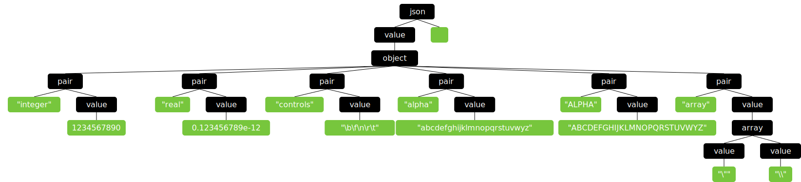

Visualize for pest
==================

## Show Cases

- Input json

```json
{
    "integer": 1234567890,
    "real": 0.123456789e-12,
    "controls": "\b\f\n\r\t",
    "alpha": "abcdefghijklmnopqrstuvwyz",
    "ALPHA": "ABCDEFGHIJKLMNOPQRSTUVWYZ",
    "array": ["\"", "\\"]
}
```


- [TreeView](./projects/pest-viewer/tests/main.rs)


```rs
use pest_viewer::{create_parser, SvgPlotter};
fn draw_json() {
    let plotter = SvgPlotter::default();
    let parser = create_parser(include_str!("json.pest")).unwrap();
    let tree = parser.parse("json", include_str!("example.json")).unwrap();
    let svg = plotter.draw(tree);
    svg::save("tests/json.svg", &svg).unwrap();
}
```

